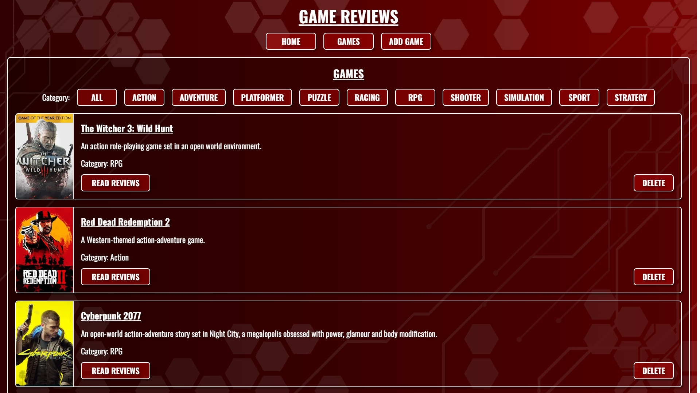
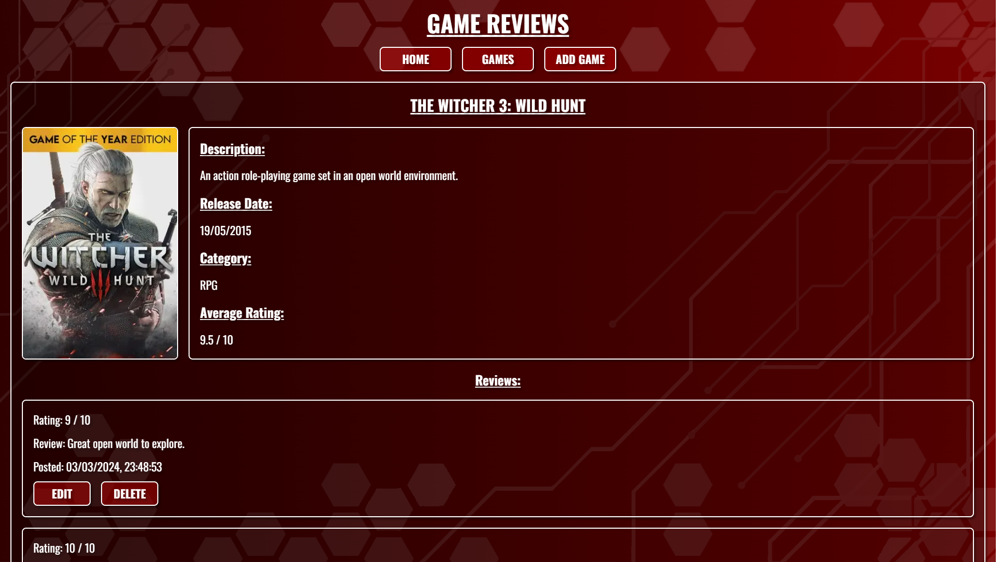

# Game Reviews

The project is deployed on Vercel and can be viewed [here](https://game-reviews-topaz.vercel.app/).

## About the project

This app was made to practice Next.js and interact with a Postgres database. It allows users to add games and write reviews for all users to see.




## Setup

### Dependencies

- [Framer-Motion](https://www.framer.com/motion/introduction/)
- [Vercel-Postgres](https://vercel.com/docs/storage/vercel-postgres)

### Getting Started

This is a [Next.js](https://nextjs.org/) project bootstrapped with [`create-next-app`](https://github.com/vercel/next.js/tree/canary/packages/create-next-app).

First, run the development server:

```bash
npm run dev
# or
yarn dev
# or
pnpm dev
# or
bun dev
```

Open [http://localhost:3000](http://localhost:3000) with your browser to see the result.

You can start editing the page by modifying `app/page.js`. The page auto-updates as you edit the file.

This project uses [`next/font`](https://nextjs.org/docs/basic-features/font-optimization) to automatically optimize and load Inter, a custom Google Font.

## References

- [Game images](https://www.steamgriddb.com/)
- [Favicon](https://www.flaticon.com/)
- [Google fonts](https://fonts.google.com/)
